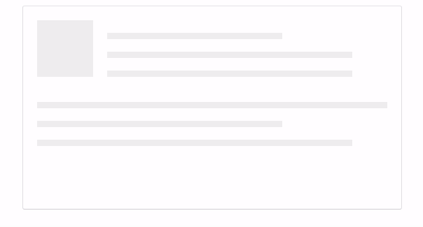

# Animated Placeholder React Component
Created with CodeSandbox

Placeholder loading animation effect similar to one that is used on sites like Facebook, LinkedIn, Instagram etc.

Such placeholders provide good UX and give users a sense of what to expect where on the page when the loading finishes.

Build with React, Styled-components and CSS Grid.

